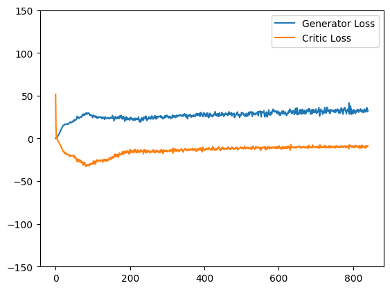
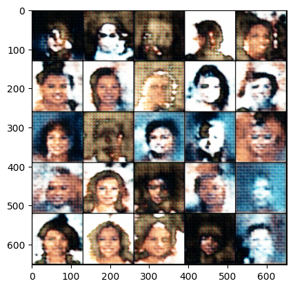
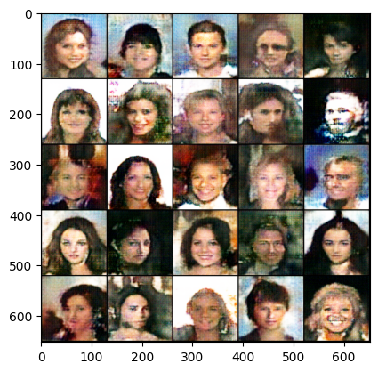

# FaceGen-GAN
A generative adversarial network (GAN) model for synthesizing face images from noise, using a generator and critic.

## Critic Model

The **Critic** is a convolutional neural network (CNN) designed to distinguish real images from fake ones generated by the Generator. It progressively downsamples the input image using convolutional layers and outputs a single value representing the "realness" of the input.

### Architecture
- **Input:** 128 x 128 x 3 (RGB image)
- **Conv Layers:**
  - Conv2d(3 -> 16, 4x4 kernel, stride 2, padding 1) -> Output: 64x64
  - Conv2d(16 -> 32, 4x4 kernel, stride 2, padding 1) -> Output: 32x32
  - Conv2d(32 -> 64, 4x4 kernel, stride 2, padding 1) -> Output: 16x16
  - Conv2d(64 -> 128, 4x4 kernel, stride 2, padding 1) -> Output: 8x8
  - Conv2d(128 -> 256, 4x4 kernel, stride 2, padding 1) -> Output: 4x4
  - Conv2d(256 -> 1, 4x4 kernel, stride 1, padding 0) -> Output: 1x1
- **Activations:** LeakyReLU (slope 0.2)
- **Normalization:** Instance Normalization

### Forward Pass
- **Input:** batch of images (128, 3, 128, 128)
- **Output:** batch of predictions (128, 1)

```python
crit_pred = self.crit(image)
return crit_pred.view(len(crit_pred), -1)
```

## Generator Model

The **Generator** is a convolutional transpose neural network (ConvTranspose2d) that takes random noise as input and transforms it into a realistic face image. It progressively upsamples the input to generate higher-resolution images.

### Architecture
- **Input:** Noise vector of shape (128, 200)
- **ConvTranspose Layers:**
  - ConvTranspose2d(200 -> 512, 4x4 kernel, stride 1, padding 0) -> Output: 4x4
  - ConvTranspose2d(512 -> 256, 4x4 kernel, stride 2, padding 1) -> Output: 8x8
  - ConvTranspose2d(256 -> 128, 4x4 kernel, stride 2, padding 1) -> Output: 16x16
  - ConvTranspose2d(128 -> 64, 4x4 kernel, stride 2, padding 1) -> Output: 32x32
  - ConvTranspose2d(64 -> 32, 4x4 kernel, stride 2, padding 1) -> Output: 64x64
  - ConvTranspose2d(32 -> 3, 4x4 kernel, stride 2, padding 1) -> Output: 128x128
- **Activations:** ReLU (for hidden layers), Tanh (for output layer)
- **Normalization:** Batch Normalization

### Forward Pass
- **Input:** Noise of shape (128, 200)
- **Reshaped to:** (128, 200, 1, 1)
- **Output:** Batch of generated images (128, 3, 128, 128)

```python
x = noise.view(len(noise), self.z_dim, 1, 1)
return self.gen(x)
```
## Noise Generator

The **Noise Generator** creates random noise vectors that serve as input to the Generator. These noise vectors are sampled from a standard normal distribution.

### Function
- **Input:** Number of noise samples (`num`) and noise dimension (`z_dim`)
- **Output:** Tensor of shape `(num, z_dim)`

### PyTorch Implementation

```python
def gen_noise(num, z_dim, device='cuda'):
    return torch.randn(num, z_dim, device=device)  # Shape: (num, z_dim)
```
### Parameters
- **num:** Batch size (e.g., `128`)
- **z_dim:** Dimension of the noise vector (e.g., `200`)
- **device:** Computing device, either `'cuda'` or `'cpu'`

## Results

### Loss Plot


### Generated Faces
**Epoch 10:**


**Epoch 50:**

